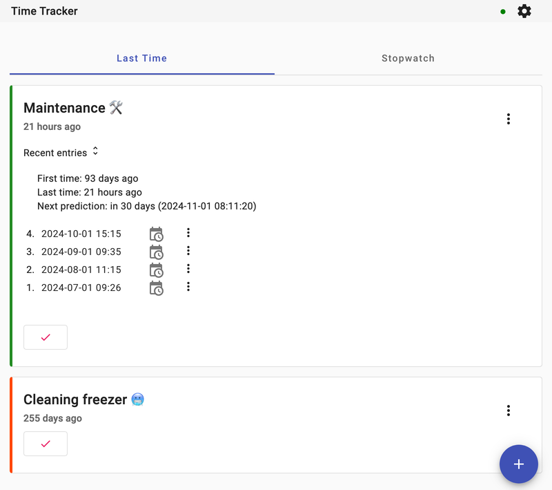
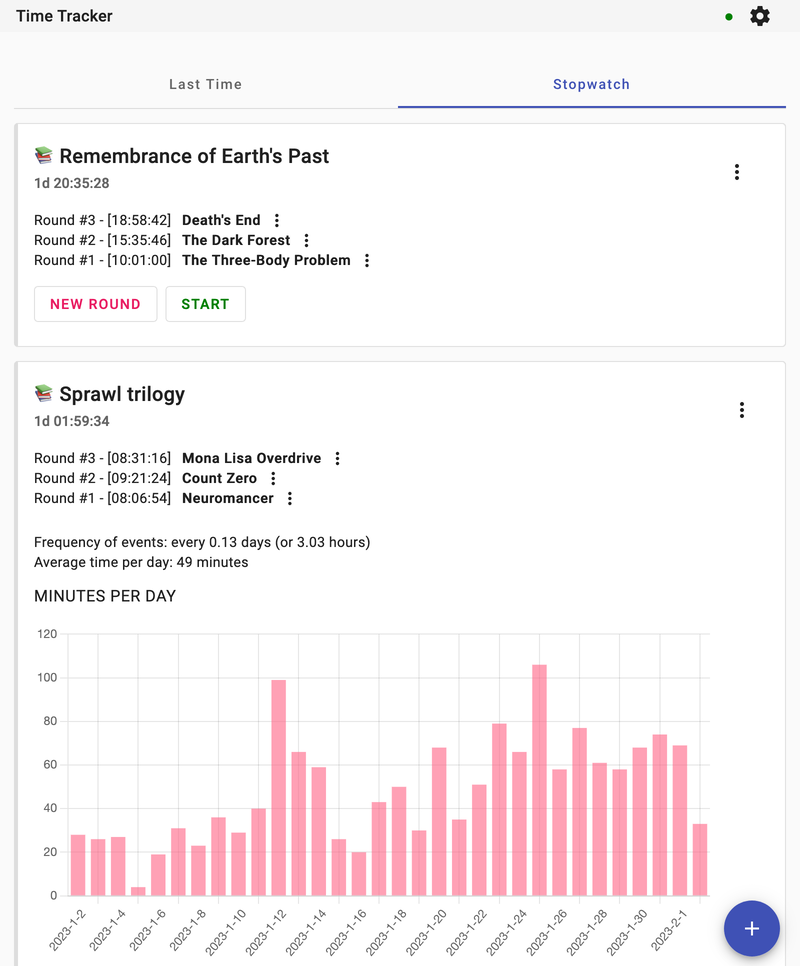

# Time Tracker

Time Tracker is a Progressive Web App (PWA) for time tracking,
specifically recording your last time events and running multiple
stopwatches.

It stores data in a local database (PouchDB), even while offline,
and can do a live sync (bidirectional data replication) with a
remote database (CouchDB). This app has been dockerized, so you
can easily run it locally or on a server, and access it via your
favorite web browser or as a PWA from your phone's main screen.

## Screenshots

### Last Time

<picture>
  <source media="(prefers-color-scheme: dark)" srcset="./.screenshots/last-time-view-dark.png">
  <source media="(prefers-color-scheme: light)" srcset="./.screenshots/last-time-view-light.png">
  
</picture>

### Stopwatch

<picture>
  <source media="(prefers-color-scheme: dark)" srcset="./.screenshots/stopwatch-view-dark.png">
  <source media="(prefers-color-scheme: light)" srcset="./.screenshots/stopwatch-view-light.png">
  
</picture>

## Running (out of the box)

```shell
docker run -it -p 8080:80 --name time-tracker ghcr.io/wojciechpolak/time-tracker
```

### Running with Docker Compose

```shell
curl https://raw.githubusercontent.com/wojciechpolak/time-tracker/master/docker-compose.yml | docker compose -f - up
```

## Building

```shell
./scripts/build-docker.sh
APP_IMAGE=wap/time-tracker docker compose up
```

## License

This project is licensed under the GNU General Public License v3.0.
See the [COPYING](COPYING) file for details.

### Icon Attribution

The icons used in this project are from the [OpenMoji](https://openmoji.org)
project and are licensed under the
[CC BY-SA 4.0](https://creativecommons.org/licenses/by-sa/4.0/) license.
